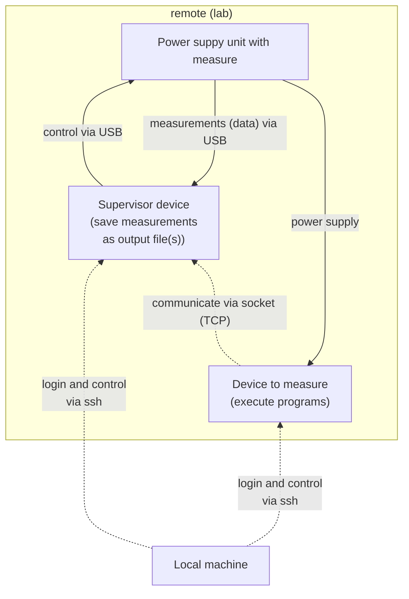
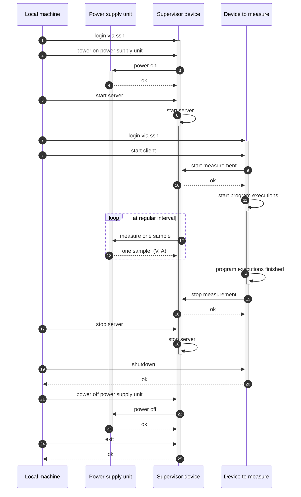
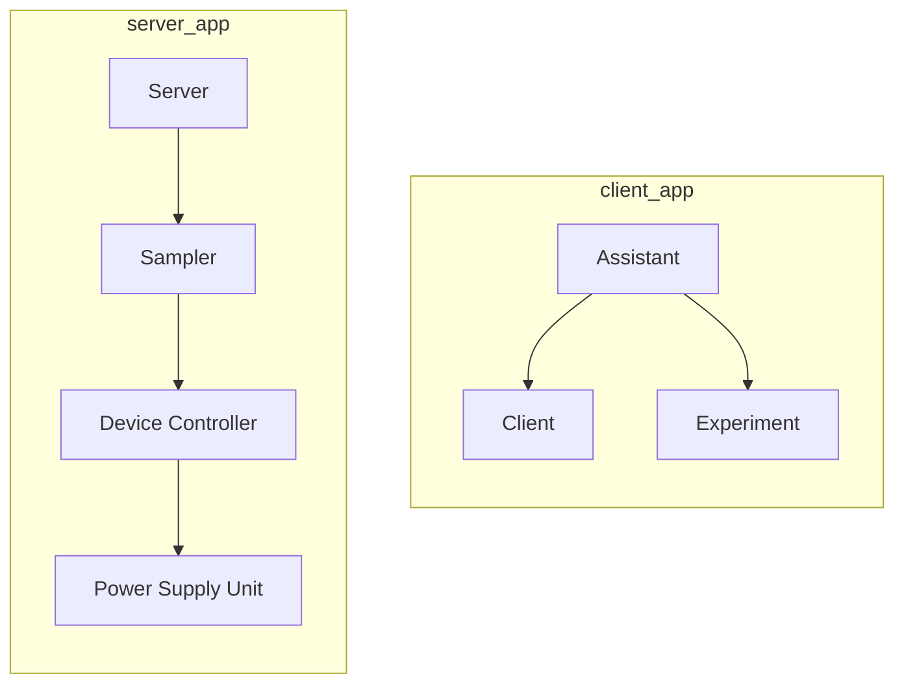

# Power Measurement with Raspberry Pi

This is a set of programs that can be used to measure the changes of voltage and current supplied to a Raspberry Pi 4 executing some programs.
The measured voltage and current measured are the values for the whole board of Rasberry Pi 4 (not a single transistor).

## Table of Contents
- [Power Measurement with Raspberry Pi](#power-measurement-with-raspberry-pi)
  - [Table of Contents](#table-of-contents)
  - [Overview](#overview)
    - [Interactions between Devices](#interactions-between-devices)
    - [Performing Measurements (Sequence Diagram)](#performing-measurements-sequence-diagram)
    - [Class Dependencies in Server and Client](#class-dependencies-in-server-and-client)
  - [How to Use?](#how-to-use)
    - [1. Start up `server_app`](#1-start-up-server_app)
    - [2. Wait for Rpi to start up and `ssh` into it](#2-wait-for-rpi-to-start-up-and-ssh-into-it)
    - [3. Start up `client_app` and perform experiments](#3-start-up-client_app-and-perform-experiments)
    - [4. After `client_app` finished its executions, terminate `server_app`](#4-after-client_app-finished-its-executions-terminate-server_app)
    - [5. Shutdown Rpi](#5-shutdown-rpi)
    - [6. Power off power supply](#6-power-off-power-supply)
  - [How to add Experiment?](#how-to-add-experiment)
    - [1. Create a new class based on the `Experiment` abstract class](#1-create-a-new-class-based-on-the-experiment-abstract-class)
    - [2. Update `client_app.py`](#2-update-client_apppy)
  - [Enabling the usage of `pyvisa` without `sudo` permission](#enabling-the-usage-of-pyvisa-without-sudo-permission)

## Overview
### Interactions between Devices


### Performing Measurements (Sequence Diagram)


### Class Dependencies in Server and Client


## How to Use?
### 1. Start up `server_app`
<!-- TODO: want to change the interface here  -->
```sh
# `--allow_public` option added to allow socket connection from other devices
python3 server_app.py --allow_public

# when `client_app` is going to be executed on the same device as `server_app`
python3 server_app.py
```

### 2. Wait for Rpi to start up and `ssh` into it
```sh
# find the ip address of Rpi
sudo nmap -sn 192.168.1.0/24 | grep "Pi" -C 5
# example output
Nmap scan report for <ip_addr_found>
Host is up (0.87s latency).
MAC Address: <mac_addr> (Raspberry Pi Trading)

# ssh into rpi
ssh ubuntu@<ip_addr_found> -i <path_to_ssh_private_key>
```

### 3. Start up `client_app` and perform experiments
<!-- TODO: want to enable command executions -->
```sh
python3 client_app.py --allow_public

# an input prompt will show up and ask for ip_addr of the device running `server_app`
```
### 4. After `client_app` finished its executions, terminate `server_app`
```sh
# ^C a few times to stop `server_app`
^C
```

### 5. Shutdown Rpi
```sh
sudo shutdown now
```

### 6. Power off power supply
```sh
python3 power_off_supply.py
```

## How to add Experiment?
### 1. Create a new class based on the `Experiment` abstract class
```py
class Experiment(ABC):
    @abstractmethod
    def get_output_filename(self) -> str:
        '''
        the filename to store experiment outputs
        '''
        pass

    @abstractmethod
    def before_run(self):
        '''
        preparation required before run
        '''
        pass

    @abstractmethod
    def run(self):
        '''
        main part of the experiment (1 experiment out of all defined experiemnts)

        things done in this function are measured and profiled.
        '''
        pass

    @abstractmethod
    def after_run(self):
        '''
        things to do after the main part of the experiment
        '''
        pass

    @abstractmethod
    def all_finished(self) -> bool:
        '''
        whether all prepared experiment are done
        '''
        pass

```

### 2. Update `client_app.py`
```py
assistant = Assistant(client=client, experiment=NewExperiment())
```

## Enabling the usage of `pyvisa` without `sudo` permission
Check the `idVendor` and `idProduct` of the device you want to control using `pyvisa`
```sh
$ lsusb
# example: Bus xxx Device xxx: ID <idVendor>:<idProduct> <Device Name>
# example: Bus 001 Device 009: ID 0b3e:1029 Kikusui Electronics Corp.
```

The permission to control (i.e., read, write) a usb device (specified by idVendor and idProduct) can be provided to certain user group by adding a udev rules.
```sh
$ sudo vi /etc/udev/rules.d/99-com.rules
```

Then, add the following to the end of `99-com.rules`.
```
ACTION=="add", SUBSYSTEMS=="usb", ATTRS{idVendor}=="<idVendor>", ATTRS{idProduct}=="<idProduct>", MODE="660", GROUP="plugdev"
```

Reload udev rules by
```sh
sudo udevadm control --reload
```

Add current user to the user group `plugdev`
```sh
adduser <current user username> plugdev
```

After all these settings, when the specified device is plugged in via USB, permission to control will be given to `plugdev` user group.
Because the user we are using also belongs to the `plugdev` group, our user has the permission to control the device.
This can be check using the following Python codes:
```py
import pyvisa

rm = pyvisa.ResourceManager()

# without permission
#
# resources info are not available because of absence of permission
print(rm.list_resources()) # returns ()

# with permission
print(rm.list_resources()) # returns ( smtg, smtg )
```

- Main Reference:
  - https://stackoverflow.com/a/32022908/11311980
- About udev rules:
  - https://linuxconfig.org/tutorial-on-how-to-write-basic-udev-rules-in-linux
  - https://hana-shin.hatenablog.com/entry/2022/04/28/223022
