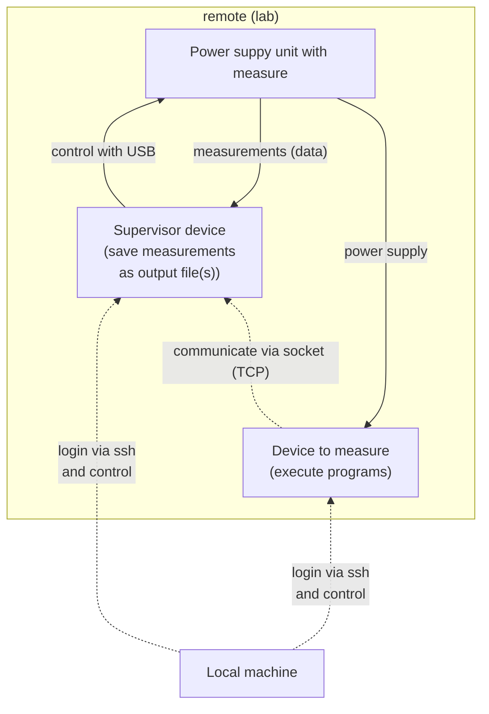
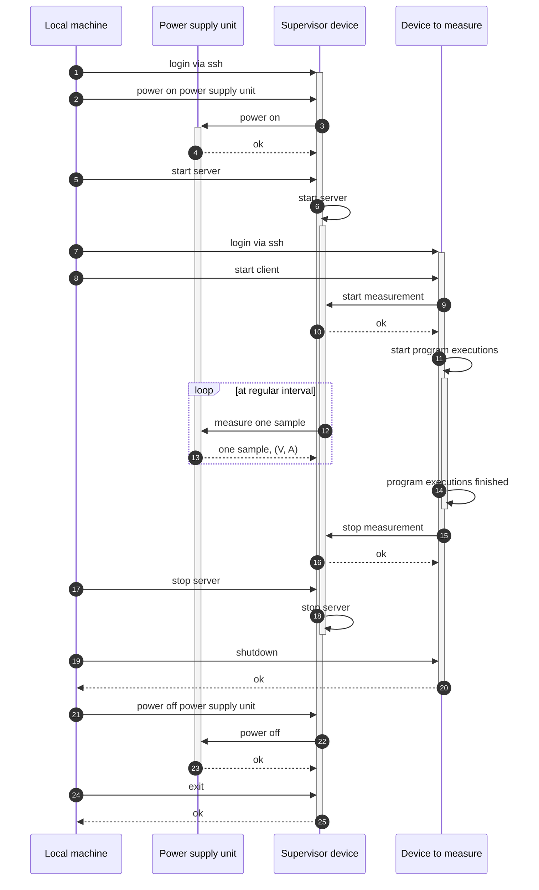
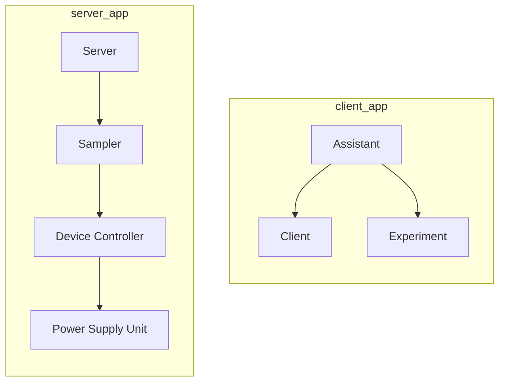

# Power Measurement with Raspberry Pi

This is a set of programs that can be used to measure the changes of voltage and current supplied to a Raspberry Pi 4 executing some programs.
The measured voltage and current measured are the values for the whole board of Rasberry Pi 4 (not a single transistor).

## Table of Contents
- [Power Measurement with Raspberry Pi](#power-measurement-with-raspberry-pi)
  - [Table of Contents](#table-of-contents)
  - [Overview](#overview)
    - [Interactions between Devices](#interactions-between-devices)
    - [Performing Measurements (Sequence Diagram)](#performing-measurements-sequence-diagram)
    - [Class Dependencies in Server and Client](#class-dependencies-in-server-and-client)

## Overview
### Interactions between Devices

### Performing Measurements (Sequence Diagram)

### Class Dependencies in Server and Client
